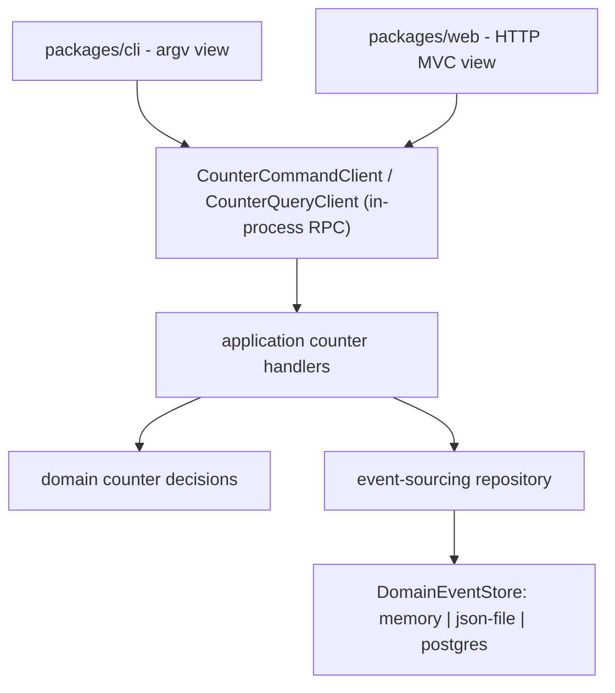

# Counter Event-Sourcing POC

A minimal, production-grade **event-sourcing** example: a bounded counter whose
state is never stored directly. Every change is an event; current state is
rebuilt by replaying the event stream.

One shared Effect application core exposes commands and queries over in-process
RPC. Two independent delivery views consume the _same_ RPC client tags:

- `packages/cli` — an argv-driven terminal view.
- `packages/web` — a server-rendered HTTP MVC view.

Neither view touches the domain or the event store directly; they depend only on
the RPC client tags in `packages/application`. That boundary is the whole point:
swap the view, keep the model.

## Architecture



The counter's rules live in `packages/domain` as pure decisions: it counts
between 0 and 5, rejects going out of bounds, and freezes when disabled. See
`features/product/counter/counter.feature` for the behavior contract.

## Start Here

Use Bun `1.3.14`.

```shell
bun install
```

### Web view

```shell
bun run start:web
```

Serves the counter page at `/` on port `3000`. Create counters, then increment,
decrement, or disable them. Every action posts a command through the RPC client
and re-renders the list rebuilt from events.

### CLI view

```shell
bun run start:cli -- create counter-1
bun run start:cli -- increment counter-1
bun run start:cli -- decrement counter-1
bun run start:cli -- disable counter-1
bun run start:cli -- list
```

Commands: `create`, `increment`, `decrement`, `disable` (each takes a counter
id), and `list`. Run with no arguments to print usage.

## Where the events land

Both views default to the `json-file` store. Events are appended to
`.counter-events.json` at the repo root (override with `EVENT_STORE_FILE`).

Open that file to see the payoff: the counter's state is derived, but the event
log is the source of truth. The CLI and web view share the same file, so a
counter created on the CLI shows up in the web view and vice versa.

## Commands

- Full gate (lint, build, tests, BDD, mutation): `bun run check`
- Everything except mutation: `bun run check:without-mutation`
- Single package gate: `bun --filter @es-ts-example/<package> check`
- Product BDD: `bun run e2e:domain` and `bun run e2e:application`
- Postgres event-store test (opt-in):
  `RUN_POSTGRES_TESTS=1 bun --filter @es-ts-example/event-sourcing test:postgres`

## Runtime configuration

- `WEB_PORT` overrides the `start:web` port wrapper; `PORT` is read by the web
  runtime and defaults to `3000`.
- `STORAGE_BACKEND` selects the store. The running views accept `memory` and
  `json-file` (default `json-file`). The `event-sourcing` package also ships a
  `postgres` store, exercised only by its opt-in test.
- `EVENT_STORE_FILE` sets the json-file path.
- `DATABASE_URL` configures the Postgres event store for the opt-in test.

## Packages

- `packages/domain`: pure counter decisions and events.
- `packages/application`: command/query handlers, RPC contracts, read models,
  and the `DomainEventStore` service.
- `packages/event-sourcing`: product-agnostic event-sourcing contracts and
  stores (memory, json-file, postgres).
- `packages/cli`: the terminal view.
- `packages/web`: the HTTP MVC view (one theme).
- `packages/test-support`: shared Effect test helpers.

## Quality gate

This POC mirrors a full enterprise gate scoped to the counter: Oxlint with
local `es-ts-example/*` architecture rules, Oxfmt, Dependency Cruiser, knip, repo policy
scripts, 100% unit coverage, property tests, Effect BDD, and Stryker mutation
testing at a **100% threshold** across every package.

See `AGENTS.md` for the contributor operating manual.
