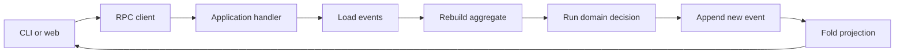

# Event Sourcing with TypeScript and Effect

This project is a small example of event sourcing.

It has two business areas:

- A counter that stays between 0 and 5.
- A user who can bookmark articles.

You can use the same application from a CLI or a web page. Both views call the
same RPC clients. Neither view reads the event store or domain code directly.

## Run it

Use Bun `1.3.14`.

```shell
bun install
bun run start:web
```

Open these pages:

- `http://localhost:3000/` shows counters.
- `http://localhost:3000/articles` shows articles and bookmarks.

The web app uses `FooBar` as the logged-in user. This keeps authentication out
of the example.

Try the CLI:

```shell
# Counter commands
bun run start:cli -- create counter-1
bun run start:cli -- increment counter-1
bun run start:cli -- list

# Bookmark commands
bun run start:cli -- articles FooBar
bun run start:cli -- bookmark FooBar events-over-state
bun run start:cli -- articles FooBar
```

The CLI and web app use the same event file. A bookmark from the CLI appears on
the web page.

## Event sourcing in one minute

A normal application often stores only its latest state:

```json
{
  "userId": "FooBar",
  "bookmarkedArticleIds": ["events-over-state"]
}
```

An event-sourced application stores the facts that caused that state:

```json
{ "_tag": "ArticleBookmarked", "userId": "FooBar", "articleId": "events-over-state" }
{ "_tag": "ArticleBookmarked", "userId": "FooBar", "articleId": "small-batches" }
{ "_tag": "ArticleBookmarkRemoved", "userId": "FooBar", "articleId": "small-batches" }
```

The application replays these events in order. The result is one bookmarked
article: `events-over-state`.

The event log is the source of truth. Current state is a result of that log.

This gives you:

- A history of what happened.
- A way to rebuild state.
- A way to create new read models from old events.
- A clear place for business rules.

It also has costs:

- You must keep event order.
- You must design stable event data.
- Queries often need separate read models.
- Old events can require migration work.

## Important words

### Command

A command asks the system to do something.

Examples:

- `IncrementCounter`
- `ToggleArticleBookmark`

A command can fail. For example, a disabled counter cannot increment.

### Event

An event records a fact that already happened.

Examples:

- `CounterIncremented`
- `ArticleBookmarked`
- `ArticleBookmarkRemoved`

Event names use the past tense because the fact is complete.

### Aggregate

An aggregate protects business rules for one item.

Examples:

- One counter aggregate protects one counter.
- One user aggregate protects one user's bookmarks.

The aggregate receives its old events, rebuilds its state, and decides whether
to record a new event.

### Reducer

A reducer applies one event to the current state.

```text
old state + event = new state
```

The reducer must be deterministic. The same events in the same order must
always produce the same state.

### Projection

A projection turns events into data that is easy to query.

The bookmark projection is a record. Its key contains a user id and article id.
Its value shows whether the bookmark is active.

```typescript
{
  "6:FooBar:events-over-state": true,
  "6:FooBar:small-batches": false
}
```

The first value is `true` because the bookmark is active. The second value is
`false` because the user removed that bookmark.

## The user bookmark domain

A user has two possible states:

```typescript
export const UserDoesNotExist = Schema.TaggedStruct("UserDoesNotExist", {});

export const ExistingUser = Schema.TaggedStruct("ExistingUser", {
  userId: UserId,
  bookmarkedArticleIds: Schema.Array(ArticleId),
});

export const UserState = Schema.Union([UserDoesNotExist, ExistingUser]);
```

There is no `UserCreated` event. A user exists after their first interaction.

The domain records two bookmark facts:

```typescript
export const ArticleBookmarked = Schema.TaggedStruct("ArticleBookmarked", {
  userId: UserId,
  articleId: ArticleId,
});

export const ArticleBookmarkRemoved = Schema.TaggedStruct("ArticleBookmarkRemoved", {
  userId: UserId,
  articleId: ArticleId,
});
```

The command is named `toggleArticleBookmark`. The event is not named
`ArticleBookmarkToggled`.

This distinction matters. A command describes intent. An event describes the
result. The event log stays clear because each event says whether the bookmark
was added or removed.

The decision is small:

```typescript
const isBookmarked =
  Schema.is(ExistingUser)(aggregate.state) &&
  Arr.contains(aggregate.state.bookmarkedArticleIds, input.articleId);

const event = isBookmarked
  ? ArticleBookmarkRemoved.make({ userId: aggregate.aggregateId, articleId: input.articleId })
  : ArticleBookmarked.make({ userId: aggregate.aggregateId, articleId: input.articleId });

return accept(recordUserEvent(event)(aggregate));
```

The first toggle records `ArticleBookmarked`. The next toggle records
`ArticleBookmarkRemoved`.

## Static articles and event-sourced bookmarks

The article catalog is normal static data. It is not part of the event-sourced
domain.

```typescript
export const articleCatalog = [
  { articleId: "events-over-state", title: "Events Over State" },
  { articleId: "effective-boundaries", title: "Effective Boundaries" },
  // ...
];
```

Only bookmark activity becomes events. This is an important boundary. Event
sourcing does not mean that all data must become an event stream.

The `ListArticles` query does three things:

1. It reads all user bookmark events.
2. It folds the events into the bookmark projection.
3. It joins the projection with the static article catalog.

The result is ready for either view:

```typescript
{
  articles: [
    {
      articleId: "events-over-state",
      title: "Events Over State",
      bookmarked: true,
    },
  ];
}
```

The CLI and web app do not repeat this join. They receive the same result from
the application RPC query.

## The counter domain

The counter shows rules that can reject commands.

- A counter starts at 0.
- Its minimum value is 0.
- Its maximum value is 5.
- A disabled counter cannot change.

For example, the increment decision checks the state before it records an
event:

```typescript
if (Schema.is(CounterNotCreated)(aggregate.state)) {
  return reject(counterDoesNotExist(aggregate.aggregateId));
}

if (Schema.is(DisabledCounter)(aggregate.state)) {
  return reject(counterIsDisabled(aggregate.aggregateId));
}

if (aggregate.state.value >= maximumCounterValue) {
  return reject(counterMaximumReached(aggregate.aggregateId));
}

return accept(
  recordCounterEvent(
    CounterIncremented.make({
      counterId: aggregate.aggregateId,
    }),
  )(aggregate),
);
```

This code does not use a database, HTTP request, or UI type. It is a pure
business decision.

See `features/product/counter/counter.feature` for examples written as product
behavior.

## Request flow



For a bookmark command:

1. The view sends `userId` and `articleId`.
2. The handler loads that user's events.
3. The repository rebuilds the user aggregate.
4. The domain chooses one bookmark event.
5. The repository appends the event.
6. The next query rebuilds the projection.

## Code map

- `packages/domain` contains states, events, reducers, and business decisions.
- `packages/application` loads aggregates, saves events, builds projections,
  and exposes RPC contracts.
- `packages/event-sourcing` contains reusable aggregate, repository,
  projection, and event-store tools.
- `packages/cli` parses arguments and renders text.
- `packages/web` handles HTTP, controllers, models, and server-rendered HTML.
- `packages/test-support` contains shared test helpers.

The dependency direction is important:

```text
CLI/Web -> Application -> Domain
                    \-> Event-sourcing tools
```

The domain does not depend on the application, CLI, or web packages.

## Inspect the event log

The default JSON event store is `.counter-events.json` in the repository root.
The old file name remains, but the file now stores counter and user events.

Set another path with `EVENT_STORE_FILE`:

```shell
EVENT_STORE_FILE=/tmp/example-events.json bun run start:web
```

The running views support these stores:

- `memory`: loses events when the process stops.
- `json-file`: writes events to a local JSON file.

The event-sourcing package also has a Postgres store for opt-in tests.

## Tests and checks

Run the full gate:

```shell
bun run check
```

This command runs:

- TypeScript builds.
- Formatting and lint checks.
- Package-boundary and repository-policy checks.
- Unit tests with 100% line coverage.
- Property tests.
- End-to-end tests.
- Mutation tests with a 100% threshold.

Use the faster gate while you work:

```shell
bun run check:without-mutation
```

Run the optional Postgres test:

```shell
RUN_POSTGRES_TESTS=1 bun --filter @es-ts-example/event-sourcing test:postgres
```

See `AGENTS.md` for contributor rules and package-specific test commands.
